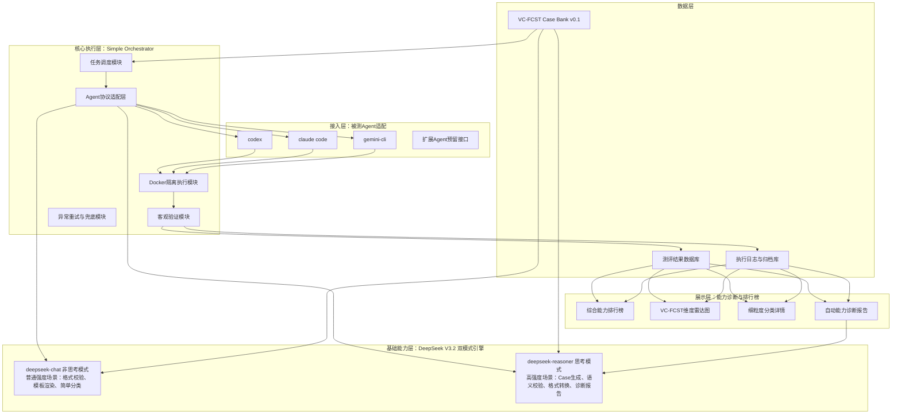
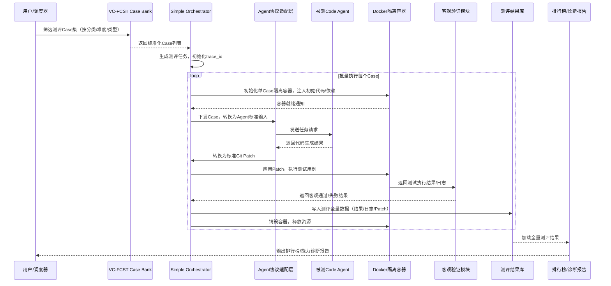

# VC-FCST Benchmark 技术方案设计（终版）
**版本**：v0.1.0
**日期**：2026年02月
**生效日期**：2026年03月
**关联规范**：Vibe Coding Fail Case Standard Taxonomy (VC-FCST) v1.0

---

## 一、方案概述
### 1.1 项目背景
当前AI代码Agent领域的主流测评体系（以SWE-bench/SWE-bench Pro为代表）均为**端到端综合能力统考**，仅能输出Agent的整体任务解决率，存在三大核心痛点：
1.  **无法细粒度定位失效根因**：真实业务场景的复合任务，无法拆解Agent失败的本质原因（是需求理解失效、代码生成失效，还是工具调用失效）；
2.  **无法实现公平的横向对比**：测评结果高度耦合Agent的Harness脚手架、检索策略、工程化能力，无法单独对比大模型原生代码能力，也无法对比不同Harness的工程化效果；
3.  **数据污染与泛化性不足**：固定的开源仓库数据集大概率出现在大模型训练集中，导致模型刷分虚高，无法反映真实的泛化能力。

VC-FCST（Vibe Coding 失效案例标准分类体系）是覆盖AI代码生成全流程的7大类、67个三级分类的失效模式分类学，本方案基于该分类体系，构建**国内首个AI代码Agent专项能力诊断测评基准**，解决现有测评体系的核心痛点。

### 1.2 核心目标
1.  **实现VC-FCST分类体系可测化**：让每个VC-FCST三级分类都有对应的、可自动化执行的测试用例，精准验证Agent在对应失效场景下的表现；
2.  **构建自动化可复用测试用例库**：通过LLM批量生成单失效点、高区分度、无污染的测试Case，支持沉淀、复用、定向扩充；
3.  **实现Code Agent细粒度横向对比**：可公平对比「大模型+Harness」组合在VC-FCST全维度的能力表现，精准定位能力短板，指导定向优化；
4.  **极致轻量化落地**：整套方案支持1个全栈工程师3个月内完成MVP全量落地，无复杂中间件依赖，零运维成本。

### 1.3 适用范围
- **目标用户**：Code Agent开发者、大模型厂商代码能力团队、企业AI研发部门、AI代码领域学术研究机构；
- **适用场景**：Agent能力诊断、大模型代码能力专项测评、Harness脚手架效果对比、AI代码生成缺陷根因分析、模型迭代效果验证；
- **适配范围**：支持所有具备API/CLI调用能力的代码大模型、Code Agent产品接入。

### 1.4 差异化定位（与SWE-bench核心对比）
| 对比维度 | VC-FCST Benchmark | SWE-bench / SWE-bench Pro |
|----------|--------------------|-----------------------------|
| 核心定位 | AI代码Agent**专项能力诊断与失效根因定位** | AI代码Agent**端到端综合工程能力统考** |
| Case设计逻辑 | 单Case单失效点，100%绑定VC-FCST单一三级分类，无复合变量 | 真实GitHub复合Issue，一个任务包含多维度能力考验，无法拆解根因 |
| 测评输出 | 全维度能力雷达图、细分分类通过率、失效模式分布、定向优化建议 | 单一整体任务解决率，仅能反映综合能力强弱 |
| 数据污染防控 | 可无限批量生成全新Case，从根源解决训练集污染问题 | 固定有限的真实仓库数据集，存在严重的训练集污染风险 |
| 变量隔离能力 | 支持双模式测评，可精准拆分「大模型原生能力」与「Harness脚手架能力」 | 仅支持端到端测评，无法区分失败根因来自模型还是脚手架 |
| 落地成本 | 轻量化单栈实现，1个全栈工程师3个月可落地 | 复杂的集群化部署，需要DevOps、测试、算法多人团队维护 |
| 测评灵活性 | 可定向生成任意分类的专项测试集，高频验证模型迭代效果 | 固定数据集，无法针对特定场景做定向测评 |

### 1.5 核心设计原则
1.  **单失效点可控原则**：每个Case仅对应VC-FCST一个三级分类，唯一变量为目标失效模式，彻底排除复合因素干扰，保证测评结果可精准归因；
2.  **LLM能力杠杆最大化原则**：能用LLM实现的逻辑绝不硬编码，通过DeepSeek V3.2双模式能力替代复杂的定制化开发，大幅降低人力成本；
3.  **100%可复现原则**：所有测评全流程的环境、输入、执行逻辑、验证标准完全固定，相同Case在相同环境下3次执行结果完全一致；
4.  **最小可用原则**：仅保留实现核心目标的最小功能模块，无过度工程化设计，无冗余依赖，保证1人可完整落地；
5.  **成本可控原则**：严格按场景匹配DeepSeek V3.2双模式，最大化利用缓存优化，全流程MVP阶段总成本控制在2500元以内；
6.  **客观量化原则**：所有测评结果100%基于自动化测试输出，无人工干预，所有指标可量化、可对比、可追溯。

---

## 二、整体架构设计
### 2.1 端到端架构总览
本方案采用**五层轻量化分层架构**，全链路闭环，无单点依赖，单栈Python即可实现：


### 2.2 分层核心职责
| 架构分层 | 核心职责 | 实现约束 |
|----------|----------|----------|
| 接入层 | 标准化适配被测Code Agent/代码大模型，提供统一的接入规范，新增Agent仅需修改YAML配置 | 无硬编码适配逻辑，10分钟完成新Agent接入 |
| 核心执行层 | 串联测评全流程，负责任务调度、协议转换、环境隔离、客观验证、异常兜底，是整个系统的核心中枢 | 单Python文件实现核心逻辑，代码总量≤1000行 |
| 数据层 | 负责测试用例、测评结果、执行日志的存储、版本管理、快速检索，无状态设计 | 仅用Parquet/JSON文件存储，无数据库、无缓存中间件，零运维 |
| 基础能力层 | 统一封装DeepSeek V3.2双模式能力，严格按场景分配模型，提供标准化的LLM调用接口，管控调用成本 | 仅使用DeepSeek V3.2两个官方模型，无其他LLM依赖 |
| 展示层 | 可视化展示测评结果，输出综合排行榜、能力雷达图、细粒度分类详情、自动诊断报告 | 单Streamlit文件实现，一键启动即可访问，无需前后端分离部署 |

### 2.3 端到端测评主流程


---

## 三、核心模块详细设计
### 3.1 VC-FCST Case Bank v0.1 详细设计
#### 3.1.1 设计目标
构建覆盖VC-FCST Top 50高频三级分类的标准化测试用例库，每个Case严格遵循单失效点原则，有效率≥90%，可自动化执行、可复用、可无限扩充，彻底解决数据污染问题。

#### 3.1.2 分类覆盖范围
从VC-FCST全量67个三级分类中，按「高发占比高、测评区分度强、纯模型可测、行业通用」原则，锁定Top 50分类，覆盖范围如下：

| 顶层分类 | 入选数量 | 核心覆盖三级分类ID |
|----------|----------|----------------------|
| 1. 需求意图与拆解失效 | 7（全量） | 1.1.1、1.1.2、1.1.3、1.1.4、1.2.1、1.2.2、1.2.3 |
| 2. 代码执行与交付失效 | 12（全量） | 2.1.1、2.1.2、2.1.3、2.2.1、2.2.2、2.2.3、2.3.1、2.3.2、2.3.3、2.4.1、2.4.2、2.4.3 |
| 3. 业务逻辑与语义实现失效 | 9（全量） | 3.1.1、3.1.2、3.1.3、3.2.1、3.2.2、3.2.3、3.3.1、3.3.2、3.3.3 |
| 4. 系统架构与仓库级协同失效 | 10 | 4.1.1、4.1.2、4.1.3、4.2.1、4.2.2、4.2.3、4.2.4、4.3.1、4.3.2、4.3.3 |
| 5. 安全与合规性失效 | 7 | 5.1.1、5.1.2、5.1.3、5.1.4、5.3.1、5.3.2、5.3.3 |
| 6. 工程化迭代与技术债务失效 | 5 | 6.1.1、6.1.2、6.1.3、6.1.4、6.1.5 |
| 7. 人因与团队协作失效 | 0 | MVP阶段暂不覆盖（无自动化测评价值） |

#### 3.1.3 单Case标准化Schema
采用Pydantic强约束定义，开启DeepSeek JSON模式输出，从生成根源锁死幻觉，所有字段必填，无冗余内容：
```python
from pydantic import BaseModel, Field
from typing import Dict, List, Literal

class VCFCSTCategory(BaseModel):
    """VC-FCST分类信息，严格绑定单三级分类"""
    level1_id: str = Field(description="顶层分类ID")
    level1_name: str = Field(description="顶层分类名称")
    level3_id: str = Field(description="三级分类ID，全局唯一绑定")
    level3_name: str = Field(description="三级分类名称")
    target_defect: str = Field(description="唯一预期失效点，严格对应三级分类定义")

class EnvConfig(BaseModel):
    """执行环境配置，保证100%可复现"""
    base_image: Literal["python:3.10-slim", "python:3.9-slim", "node:18-slim"] = Field(
        default="python:3.10-slim",
        description="全量Case仅用3个固定官方镜像，降低维护成本"
    )
    dependencies: List[str] = Field(description="固定版本的依赖包，例：['pytest==8.0.0']")
    network_disabled: bool = Field(default=True, description="默认关闭外网，避免模型抄答案")
    resource_limit: Dict[str, str] = Field(
        default={"cpu": "1", "memory": "2G"},
        description="固定资源限制，避免环境差异影响测评结果"
    )

class AcceptanceCriteria(BaseModel):
    """客观验收标准，100%可自动化验证"""
    test_code: Dict[str, str] = Field(description="key为文件相对路径，value为pytest测试代码")
    static_rules: List[str] = Field(default=[], description="可选，Semgrep扫描规则，用于检测目标缺陷")
    pass_condition: str = Field(description="唯一客观通过标准，例：pytest tests/ 通过率100%")

class VCFCSTCase(BaseModel):
    """单Case标准化结构，最小完备单元"""
    case_id: str = Field(
        description="全局唯一ID，格式：VCFCST-{level3_id}-{序号}，例：VCFCST-1.1.2-001"
    )
    vcfcst_category: VCFCSTCategory
    difficulty: Literal["Easy", "Medium", "Hard"] = Field(
        description="难度占比：Easy40%/Medium40%/Hard20%"
    )
    case_type: Literal["implement", "modify"] = Field(
        description="类型占比：implement60%/modify40%"
    )
    requirement: str = Field(description="给Agent的自然语言需求，和真实用户输入完全一致，无刻意引导")
    initial_code: Dict[str, str] = Field(
        description="初始仓库代码，key为文件相对路径，value为文件内容，骨架100%可运行"
    )
    acceptance_criteria: AcceptanceCriteria
    env_config: EnvConfig
```

#### 3.1.4 Case生成全流程设计
##### 3.1.4.1 分类级Prompt模板设计
每个VC-FCST三级分类对应一个固定Prompt模板，核心要求：
- 严格对齐分类的缺陷定义，明确唯一预期失效点；
- 需求描述符合真实用户输入习惯，无刻意提示缺陷点；
- 明确测试用例的设计要求，保证可精准检测目标缺陷；
- 强制要求输出符合Pydantic Schema的JSON格式，开启JSON模式。

示例模板（1.1.2 需求语义误解分类）：
```
你是VC-FCST测试用例生成专家，需要生成严格对应VC-FCST 1.1.2「需求语义误解」分类的测试Case，核心是测试代码大模型是否会错误解读行业术语、业务规则。

=== 严格遵守以下生成规则 ===
1.  单Case单失效点：仅测试「行业术语语义误解」这一个缺陷，除了目标失效点，其他所有环节（代码骨架、依赖、测试用例）必须100%正确，无任何额外错误
2.  需求必须包含有明确行业共识的专业术语，存在清晰的语义误解风险，无刻意提示
3.  测试用例必须能100%精准区分「正确理解术语」和「错误理解术语」的结果，无歧义
4.  初始代码骨架完整，可直接运行，无语法错误、无依赖缺失
5.  必须使用全新的业务场景，禁止使用MAU计算的示例，场景覆盖金融、电商、物流、内容平台等
6.  严格按照下方的JSON Schema输出，禁止添加任何额外内容、注释、markdown格式，必须是纯JSON，可直接被Pydantic解析

=== JSON Schema ===
{完整的VCFCSTCase Pydantic Schema JSON格式}
```

##### 3.1.4.2 批量生成逻辑
采用Python+LiteLLM实现单文件批量生成脚本，核心逻辑：
1.  循环遍历Top 50三级分类，按固定比例生成不同难度、类型的Case，每个分类50个；
2.  核心生成环节**强制使用deepseek-reasoner思考模式**，开启JSON结构化输出，降低幻觉；
3.  自动处理格式校验、失败重试，单Case最多重试3次；
4.  生成后的Case按分类存储为JSON文件，同时合并为Parquet主文件。

##### 3.1.4.3 4层自动化防幻觉校验流水线
生成后的Case经过4层全自动过滤，无效Case自动重生成，无需人工干预，最终有效率≥90%：
| 校验层级 | 校验内容 | 使用模型 | 过滤目标 |
|----------|----------|----------|----------|
| 1. 格式合规性校验 | 校验Case是否符合Pydantic Schema，必填字段完整、格式正确 | deepseek-chat | 格式错误、字段缺失、结构混乱的基础幻觉 |
| 2. 可执行性校验 | 自动启动Docker容器，验证初始代码可运行、测试用例逻辑正确、依赖可正常安装 | 无LLM，纯代码自动化 | 代码语法错误、测试用例本身有bug、依赖配置无效的生成 |
| 3. 区分度校验 | 强弱基准双校验：<br>1. 强基准：deepseek-reasoner必须100%通过Case<br>2. 弱基准：deepseek-chat（temperature=0.1）通过率≤30%<br>仅保留同时满足两个条件的Case | 强基准：deepseek-reasoner<br>弱基准：deepseek-chat | 太简单/太难、无法区分模型能力的无效Case |
| 4. 语义一致性校验 | 校验Case是否严格绑定目标VC-FCST分类，仅包含唯一预期失效点，无偏离 | deepseek-reasoner | 失效点与分类不匹配、引入额外变量的语义幻觉 |

#### 3.1.5 存储与版本管理
- **主存储格式**：全量有效Case合并为单个Parquet文件，列式存储占用空间小，Pandas可毫秒级读取、筛选；
- **原始文件存储**：单Case按分类目录存储为JSON文件，便于人工审核、修改、版本追溯；
- **版本管理**：所有生成脚本、Prompt模板、Case文件全部提交到GitHub，用Git做版本化管理，每个版本有明确的变更记录；
- **工具化封装**：提供极简`CaseLoader`工具类，支持按分类、难度、类型快速筛选Case，一行代码加载批量测试集。

#### 3.1.6 验收标准
1.  覆盖VC-FCST Top 50三级分类，每个分类≥50个有效Case，总计≥2500个；
2.  所有Case严格遵循单失效点原则，100%绑定对应VC-FCST三级分类；
3.  4层自动化校验通过率100%，人工抽检10%有效率≥90%；
4.  所有Case可100%复现，相同环境下3次执行结果完全一致；
5.  提供开箱即用的Case加载、筛选工具类，支持批量测评。

---

### 3.2 Simple Orchestrator v0.1 详细设计
#### 3.2.1 设计目标
构建轻量化、无状态、可扩展的测评执行引擎，支持codex/claude code/gemini-cli三款首批模型接入，单Case全流程自动化执行，无需人工干预，执行成功率≥95%，核心代码总量≤1000行。

#### 3.2.2 核心模块架构
采用5个核心模块的扁平化设计，无复杂依赖，单Python文件即可实现：

| 模块名称 | 核心职责 | 实现约束 |
|----------|----------|----------|
| 任务调度模块 | 负责Case加载、任务拆分、批量执行、进度管理、结果汇总 | 支持多进程并行执行，支持断点续跑 |
| Agent协议适配层 | 用DeepSeek V3.2实现统一的输入输出转换，无需硬编码适配逻辑 | 新增Agent仅需新增1个YAML配置文件，10分钟完成接入 |
| Docker隔离执行模块 | 负责单Case容器的初始化、代码注入、命令执行、资源销毁 | 单Case单容器，执行完成自动销毁，避免环境交叉污染 |
| 客观验证模块 | 负责Patch应用校验、测试用例执行、结果判定，100%客观无人工干预 | 严格按照Case的pass_condition输出结果，无主观判断 |
| 异常重试与兜底模块 | 负责超时处理、失败重试、异常分类、错误日志留存 | 可配置重试次数、超时时间，异常场景有明确的错误分类 |

#### 3.2.3 核心模块详细设计
##### 3.2.3.1 Agent协议适配层
核心设计：**用DeepSeek V3.2双模式做统一的输入输出转换，彻底摒弃硬编码适配逻辑**，每个被测Agent仅需一个YAML配置文件，即可完成接入。

**被测Agent配置模板示例（codex.yaml）**：
```yaml
agent_name: "codex"
litellm_model_name: "openai/code-davinci-002"
api_key_env: "OPENAI_API_KEY"
max_tokens: 4096
temperature: 0.2
timeout: 120

# 输入模板：把标准化Case转为模型的输入Prompt
input_template: |
  请完成以下Python开发任务，严格按照要求输出代码：
  【任务需求】
  {{ case.requirement }}
  【仓库现有代码】
  
  文件路径：{{ path }}
  # python 代码
  ---
  {{ content }}
  ---
  
  【验收标准】
  你的代码必须通过以下pytest测试用例：
  
  文件路径：{{ path }}
  # pytest 测试用例
  {{ content }}
  ---
  
  要求：
  1. 仅输出完整的可运行代码，不要添加任何解释、注释、markdown格式
  2. 仅修改需要改动的文件，保留原有代码的结构和内容
  3. 不要添加任何验收标准外的额外功能

# 输出转换模板：把模型输出转为标准Git Patch
output_template: |
  请把以下代码生成结果，转换为标准的git diff格式Patch，严格遵循以下要求：
  1. 补丁必须基于仓库根目录的相对路径，和初始代码的文件路径完全一致
  2. 仅包含和任务相关的代码变更，保留原有代码的正确内容
  3. 严格遵循git diff的标准格式，无多余内容、无注释、无解释
  【仓库初始代码】
  {{ case.initial_code | tojson }}
  【模型生成的代码】
  {{ model_raw_output }}
```

**适配层核心代码**：
```python
import os
import yaml
from jinja2 import Template
from litellm import completion

# 全局合规配置
DEEPSEEK_API_KEY = os.getenv("DEEPSEEK_API_KEY")
BASE_URL = "https://api.deepseek.com"
REASONER_MODEL = "deepseek/deepseek-reasoner"
CHAT_MODEL = "deepseek/deepseek-chat"

class ModelAdapter:
    def __init__(self, config_dir: str = "./model_configs"):
        self.config_dir = config_dir
        self.configs = self._load_all_configs()

    def _load_all_configs(self) -> dict:
        """加载所有被测模型的YAML配置文件"""
        configs = {}
        for file in os.listdir(self.config_dir):
            if file.endswith(".yaml"):
                model_name = file.replace(".yaml", "")
                with open(f"{self.config_dir}/{file}", "r", encoding="utf-8") as f:
                    configs[model_name] = yaml.safe_load(f)
        return configs

    def case_to_model_prompt(self, case: dict, model_name: str) -> str:
        """纯Jinja2模板渲染，无LLM调用，零成本"""
        config = self.configs[model_name]
        template = Template(config["input_template"])
        return template.render(case=case)

    def call_target_model(self, prompt: str, model_name: str) -> str:
        """调用被测代码大模型，统一用LiteLLM封装"""
        config = self.configs[model_name]
        resp = completion(
            model=config["litellm_model_name"],
            messages=[{"role": "user", "content": prompt}],
            api_key=os.getenv(config["api_key_env"]),
            max_tokens=config["max_tokens"],
            temperature=config["temperature"],
            timeout=config["timeout"]
        )
        return resp.choices[0].message.content.strip()

    def output_to_git_patch(self, model_raw_output: str, case: dict) -> str:
        """用deepseek-reasoner生成标准Git Patch，保证格式合规"""
        template = Template(self.configs["patch_converter"]["output_template"])
        prompt = template.render(case=case, model_raw_output=model_raw_output)
        
        for retry in range(3):
            try:
                resp = completion(
                    model=REASONER_MODEL,
                    base_url=BASE_URL,
                    messages=[{"role": "user", "content": prompt}],
                    api_key=DEEPSEEK_API_KEY,
                    temperature=0.1,
                    timeout=60
                )
                patch = resp.choices[0].message.content.strip()
                if patch.startswith("diff --git"):
                    return patch
            except Exception as e:
                print(f"Patch转换失败，重试{retry+1}次：{str(e)}")
                continue
        return ""
```

##### 3.2.3.2 Docker隔离执行模块
基于Docker SDK for Python实现，核心逻辑：
1.  单Case单容器，基于Case的env_config创建容器，固定资源限制，默认关闭外网；
2.  自动注入初始代码、测试用例、依赖配置，安装所需依赖；
3.  提供标准化的命令执行接口，支持Patch应用、测试用例执行、日志回收；
4.  无论执行成功或失败，最终自动销毁容器，释放资源，避免环境交叉污染和资源泄漏。

##### 3.2.3.3 客观验证模块
100%客观验证，无人工干预，核心执行逻辑：
1.  **Patch应用校验**：自动执行`git apply`，验证补丁是否能无冲突应用到初始代码，应用失败直接标记为失败；
2.  **测试用例执行**：在容器内运行pytest测试用例，获取通过率、失败详情、执行日志；
3.  **静态规则校验**：若Case配置了Semgrep规则，自动执行静态扫描，检测是否存在目标缺陷；
4.  **结果判定**：严格按照Case的`pass_condition`输出`passed`/`failed`结果，同时记录失败根因、执行日志、测试结果。

#### 3.2.4 首批接入Agent选型
| 被测Agent/模型 | 接入方式 | 适配优先级 |
|----------------|----------|------------|
| OpenAI codex | API调用 | P0 |
| Anthropic claude code | API调用 | P0 |
| Google gemini-cli | CLI/API调用 | P0 |
| 其他扩展Agent | 预留配置接口 | P1 |

#### 3.2.5 异常处理与兜底机制
1.  **超时控制**：全链路三级超时管控，单Case总超时、模型调用超时、容器执行超时，避免无限等待；
2.  **失败重试**：模型调用、Patch转换、测试执行等可重试环节，支持配置重试次数（默认2次）、退避策略；
3.  **异常分类**：所有异常场景分为「环境异常、模型调用异常、Patch应用异常、测试不通过、系统异常」5大类，便于后续根因分析；
4.  **断点续跑**：支持从失败的Case继续执行，无需重复跑已完成的Case，避免资源浪费；
5.  **优雅关闭**：程序中断时，自动销毁正在运行的容器，释放资源，避免资源泄漏。

#### 3.2.6 验收标准
1.  支持codex/claude code/gemini-cli三款模型接入，新增Agent接入时间≤10分钟；
2.  单Case全流程自动化执行，无需人工干预，执行成功率≥95%；
3.  超时、执行失败有重试与兜底机制，异常场景有明确的错误分类；
4.  结果判定100%客观，和Case的验收标准完全一致，无主观偏差；
5.  所有执行结果、日志、Patch完整留存，100%可复现。

---

### 3.3 VC-FCST 能力排行榜与诊断系统 详细设计
#### 3.3.1 设计目标
纯Python Streamlit实现，一键启动即可访问，输出可横向对比的综合排行榜、VC-FCST维度能力雷达图、细粒度分类详情、自动能力诊断报告，精准定位Agent的能力短板。

#### 3.3.2 核心量化指标体系
所有指标100%可量化、可对比，和VC-FCST分类体系强绑定：

| 指标类型 | 指标名称 | 计算公式 | 指标用途 |
|----------|----------|----------|----------|
| 综合排名指标 | 整体通过率 | （通过Case数 / 总执行有效Case数）* 100% | 综合能力排名核心依据 |
| 细粒度分类指标 | 三级分类通过率 | （该分类下通过Case数 / 该分类总执行Case数）* 100% | 精准定位细分场景能力 |
| 细粒度分类指标 | 顶层分类平均通过率 | 该顶层分类下所有三级分类通过率的算术平均值 | 能力雷达图核心维度 |
| 缺陷防控指标 | 分类缺陷逃逸率 | （该分类下触发预期缺陷的Case数 / 该分类总执行Case数）* 100% | 评估Agent对应失效模式的防控能力 |
| 难度分层指标 | Easy/Medium/Hard通过率 | 对应难度下的Case通过率 | 评估Agent的能力边界 |
| 效率指标 | 平均执行时长 | 单Case平均执行时间（秒） | 评估Agent的执行效率 |
| 成本指标 | 平均Token消耗 | 单Case平均Token消耗量 | 评估Agent的使用成本 |

#### 3.3.3 可视化页面设计
单Streamlit文件实现，包含5个核心页面，无前后端分离部署，一键启动即可访问：
1.  **综合能力排行榜首页**
    - 核心内容：所有被测Agent的综合排名表格，按整体通过率降序排列，展示所有核心指标（整体通过率、各难度通过率、平均执行时长、平均Token消耗）；
    - 交互能力：支持按指标排序、筛选Agent、导出Excel数据、切换测评批次。

2.  **VC-FCST 维度能力雷达图**
    - 核心内容：以VC-FCST 6大顶层分类为维度，生成多Agent对比雷达图，一眼看出不同Agent的能力分布差异；
    - 交互能力：支持选择多个Agent叠加对比，点击雷达图维度直接跳转到对应三级分类详情页。

3.  **细粒度分类详情页**
    - 核心内容：选中顶层分类下，所有三级分类的Agent通过率排名柱状图、缺陷逃逸率对比；
    - 交互能力：支持按顶层分类、Agent筛选，支持按通过率/缺陷逃逸率排序，查看分类下所有Case的执行详情。

4.  **Case级执行详情页**
    - 核心内容：Case的基本信息、Agent的输入输出、生成的Git Patch、测试执行日志、失败根因分析；
    - 交互能力：支持按Case ID、分类、Agent、执行结果筛选，支持一键复现对应Case的测评过程，支持日志导出。

5.  **自动能力诊断报告页**
    - 核心内容：选中Agent的完整能力诊断报告，包括能力画像、核心优势、核心短板、针对性优化建议、失效模式分布分析；
    - 交互能力：支持选择Agent生成报告，支持报告导出为PDF格式。

#### 3.3.4 自动诊断报告生成逻辑
基于全量测评结果，用`deepseek-reasoner`思考模式生成专业的诊断报告，核心Prompt框架：
```
请基于以下VC-FCST测评数据，生成一份专业、简洁、可落地的Code Agent能力诊断报告：
【模型基本信息】
模型名称：{model_name}
整体测评Case数：{total_case_num}
整体通过率：{overall_pass_rate}%
各顶层分类通过率：{level1_pass_rate_json}
各三级分类通过率TOP3/倒数3：{top_bottom_category}
失效模式分布：{failure_distribution_json}

【报告生成要求】
1.  清晰总结模型的核心能力优势与核心短板，严格对应VC-FCST分类体系；
2.  分析模型最容易出现的失效模式，给出可落地的定向优化建议；
3.  对比行业基准水平，给出模型的能力定位；
4.  语言专业严谨，结构清晰，不超过1000字。
```

#### 3.3.5 验收标准
1.  完整展示所有被测Agent的综合排名，核心指标完整可排序；
2.  支持多Agent的VC-FCST 6大维度雷达图对比，直观展示能力差异；
3.  支持按分类筛选查看细粒度详情，Case级执行结果可追溯、可复现；
4.  自动生成模型能力诊断报告与优化建议，支持PDF导出；
5.  一键启动即可访问，无需复杂部署，执行`streamlit run rank.py`即可打开页面。

---

## 四、DeepSeek V3.2 模型使用与成本管控方案
### 4.1 官方规范对齐

| 官方模型名 | 对应模式 | BASE URL | 核心能力 | 输出长度限制 |
|------------|----------|-----------|----------|--------------|
| deepseek-chat | DeepSeek-V3.2 非思考模式 | https://api.deepseek.com | 普通强度推理、格式校验、模板渲染、简单分类 | 默认4K，最大8K |
| deepseek-reasoner | DeepSeek-V3.2 思考模式 | https://api.deepseek.com | 高强度推理、Case生成、语义校验、复杂格式转换、诊断报告 | 默认32K，最大64K |

### 4.2 双模式场景匹配规范

严格按场景分配模型，既保证效果，又最大化降低成本，无任何其他LLM依赖：

| 业务场景 | 选用模型 | 核心原因 |
|----------|----------|----------|
| 单Case核心生成 | deepseek-reasoner | 强推理需求，需要精准匹配VC-FCST分类、单失效点设计，长文本输出 |
| 语义一致性校验 | deepseek-reasoner | 需要深度推理Case与目标分类的匹配度，强逻辑校验需求 |
| 区分度强基准校验 | deepseek-reasoner | 作为合格基准，保证Case的正确性 |
| Git Patch格式转换 | deepseek-reasoner | 需要精准理解代码变更，生成符合规范的Git Patch |
| 自动能力诊断报告生成 | deepseek-reasoner | 需要深度分析测评数据，生成专业的诊断报告与优化建议 |
| 格式合规性校验 | deepseek-chat | 低复杂度JSON格式校验，8K输出长度完全满足，降本 |
| 区分度弱基准校验 | deepseek-chat | 作为弱基准，限制推理深度，保证Case区分度 |
| 执行失败根因简单分类 | deepseek-chat | 低复杂度文本分类，8K输出长度完全满足，降本 |
| 固定模板渲染 | 无LLM，纯Jinja2实现 | 零成本，完全避免不必要的LLM调用 |

### 4.3 API调用规范
1.  统一使用LiteLLM封装调用，兼容官方API规范，无需定制化开发；
2.  所有JSON格式输出场景，强制开启`response_format={"type": "json_object"}`，降低幻觉；
3.  所有调用配置超时时间、重试机制，避免接口异常导致流程中断；
4.  全量调用日志留存，包含Token消耗量、调用时长、响应状态，便于成本核算与异常排查。

### 4.4 全流程成本测算
基于DeepSeek官方最新定价，含60%缓存命中率优化，MVP阶段全流程总成本控制在2500元以内：

| 业务环节 | 选用模型 | 预估Token消耗 | 成本测算（含缓存） |
|----------|----------|--------------|-------------------|
| 2500个Case核心生成 | deepseek-reasoner | 输入600万Token，输出300万Token | 1452元 |
| 格式+语义一致性校验 | deepseek-chat+reasoner | 输入150万Token，输出50万Token | 186元 |
| 区分度强弱基准校验 | deepseek-chat+reasoner | 输入200万Token，输出100万Token | 374元 |
| 协议适配Patch转换 | deepseek-reasoner | 输入300万Token，输出100万Token | 558元 |
| 自动诊断报告生成 | deepseek-reasoner | 输入50万Token，输出20万Token | 125元 |
| 预留重试缓冲 | 双模型 | 输入100万Token，输出50万Token | 183元 |
| **全流程总计** | - | 输入1400万Token，输出620万Token | **2878元** |

### 4.5 成本优化策略
1.  **缓存最大化优化**：固定Prompt模板、重复结构内容统一放在系统提示词中，最大化触发官方缓存命中，缓存定价仅为非缓存的1/10，可大幅降低输入成本；
2.  **模型精准匹配**：低复杂度场景严格使用deepseek-chat，仅核心强推理场景使用deepseek-reasoner，避免高成本模型滥用；
3.  **批量处理优化**：支持批量Prompt合并处理，减少重复的系统提示词Token消耗；
4.  **重试机制优化**：失败重试仅针对核心环节，非核心环节失败不重试，避免无效Token消耗；
5.  **Token长度控制**：所有Prompt模板精简优化，去除冗余内容，控制单轮调用的Token长度。

---

## 五、落地实施计划（1个全栈工程师，3个月可落地）

| 阶段 | 时间 | 核心任务 | 交付物 | 验收标准 |
|------|------|----------|--------|----------|
| 第一阶段：最小闭环验证 | 第1-2周 | 1. 锁定Top 50 VC-FCST三级分类，完成Pydantic Schema定义<br>2. 完成1个分类的Prompt模板编写，试点生成10个Case<br>3. 完成Orchestrator最小核心框架，跑通单Case端到端执行<br>4. 完成排行榜最小页面开发 | 1. Top 50分类清单、Case Schema定义文档<br>2. 试点Case库（10个）<br>3. Orchestrator最小可行脚本<br>4. 排行榜最小页面 | 单Case从加载、模型调用、验证到结果展示全流程跑通，无人工干预，所有LLM调用严格遵循DeepSeek规范 |
| 第二阶段：Case Bank v0.1 交付 | 第3-4周 | 1. 完成Top 50分类的Prompt模板全量编写<br>2. 批量生成2500个原始Case<br>3. 完成4层自动化校验流水线开发<br>4. 人工抽检10%的Case，优化Prompt模板与校验逻辑<br>5. 完成Case Bank存储、加载工具类开发 | 1. VC-FCST Case Bank v0.1 全量Parquet文件<br>2. Case生成脚本、Prompt模板库<br>3. 自动化校验工具、Case加载工具类<br>4. Case Bank使用文档 | 覆盖Top 50分类，2500个有效Case，有效率≥90%，可直接用于自动化测评 |
| 第三阶段：Orchestrator v0.1 交付 | 第5-8周 | 1. 完善Orchestrator核心编排器、Docker隔离执行模块<br>2. 完成DeepSeek协议适配层开发，编写3款被测模型的YAML配置<br>3. 完善客观验证模块、异常重试与兜底模块<br>4. 全流程联调，修复异常场景，优化执行稳定性<br>5. 完成单模型全量Case批量测评跑通 | 1. Simple Orchestrator v0.1 完整代码<br>2. 3款被测模型的适配配置文件<br>3. 测评结果标准化Schema<br>4. Orchestrator使用文档 | 支持3款被测模型接入，单Case执行成功率≥95%，全流程自动化，结果100%可复现 |
| 第四阶段：排行榜与MVP全量发布 | 第9-12周 | 1. 完成Streamlit排行榜全量页面开发，实现所有可视化功能<br>2. 完成3款模型的全量Case测评，生成完整测评结果<br>3. 完成自动能力诊断报告功能开发<br>4. 全流程Bug修复、文档完善<br>5. MVP版本正式发布 | 1. VC-FCST 能力排行榜完整代码<br>2. 3款模型的完整测评报告<br>3. MVP完整代码仓库、部署指南、使用文档 | 排行榜完整展示所有指标，全流程端到端跑通，可输出可复现的模型横向对比报告，一键启动即可使用 |

### 5.1 资源需求
#### 硬件资源
- 开发/测评服务器：4核8G Linux服务器，100G SSD存储，单台即可满足全流程需求；
- 本地开发环境：Windows/MacOS 开发机，安装Docker、Python 3.10+环境。

#### 软件/权限资源
- DeepSeek API账号，开通deepseek-chat、deepseek-reasoner模型调用权限；
- 被测模型（codex/claude code/gemini-cli）的API调用权限；
- GitHub代码仓库，用于版本管理与开源发布。

---

## 六、风险管控与缓解措施
| 风险ID | 风险描述 | 影响等级 | 发生概率 | 缓解措施 | 应急预案 |
|--------|----------|----------|----------|----------|----------|
| R01 | Case生成幻觉率高，有效率不足90% | 高 | 中 | 1. 核心生成强制使用deepseek-reasoner，开启JSON模式；<br>2. 4层自动化校验流水线过滤无效Case；<br>3. 先小批量试点优化Prompt模板，再全量生成；<br>4. 仅人工抽检10%的Case，保证整体质量 | 针对低质量分类，优化Prompt模板，重新生成对应Case |
| R02 | 被测模型接入适配困难 | 中 | 低 | 1. 用DeepSeek双模式做统一输入输出转换，无需硬编码适配逻辑；<br>2. 先接入接入成本最低的codex，验证适配层逻辑，再扩展其他模型；<br>3. 提供标准化的配置模板，降低接入成本 | 针对适配困难的模型，先实现CLI调用兜底方案，保证流程跑通 |
| R03 | LLM调用成本超支 | 中 | 中 | 1. 严格按场景匹配双模型，低复杂度场景用低成本chat模型；<br>2. 优化Prompt模板，最大化触发缓存命中；<br>3. 配置单任务Token上限，避免无效消耗；<br>4. 全流程Token消耗监控，超阈值告警 | 触发成本告警时，暂停非核心环节的LLM调用，优化Prompt模板降低Token消耗 |
| R04 | 批量测评执行时间过长 | 中 | 中 | 1. 支持多进程并行执行，4核服务器可同时跑4个Case；<br>2. 支持夜间无人值守批量执行，断点续跑；<br>3. 优化容器初始化流程，复用基础镜像层，缩短启动时间 | 针对大规模测评，拆分任务分批次执行，避免资源耗尽 |
| R05 | Docker环境兼容性问题 | 低 | 低 | 1. 全量Case仅用3个官方固定Docker镜像，提前验证可用性；<br>2. 提供本地Docker Desktop开发适配方案；<br>3. 容器执行全量日志留存，便于问题排查 | 针对环境异常的Case，自动重试，仍失败则标记为环境异常，单独排查 |
| R06 | 1人开发工作量超支 | 高 | 低 | 1. 严格遵守MVP边界，所有非核心功能100%砍掉；<br>2. 渐进式开发，每2周有可验证的交付物，避免返工；<br>3. 最大化利用LLM能力替代硬编码开发，降低人力成本 | 优先保证核心流程跑通，非核心功能延后到后续版本迭代 |

---

## 七、后续演进路线
### 7.1 v0.2 版本规划（MVP发布后1-2个月）
1.  扩展Case Bank到VC-FCST全量67个三级分类，每个分类100个Case；
2.  接入更多主流Code Agent（Aider、OpenHands、AutoCoder等）；
3.  增加多维度测评对比功能，支持不同版本模型、不同Prompt策略的对比；
4.  优化批量执行效率，支持分布式集群部署。

### 7.2 v1.0 版本规划（MVP发布后3-6个月）
1.  完善企业级特性，增加多租户权限管控、测评任务队列、精细化权限管理；
2.  构建VC-FCST开放数据集，开源到Hugging Face，形成行业基准；
3.  增加自定义Case上传、自定义测评模板功能，支持企业私有场景适配；
4.  完善API接口，支持与CI/CD流水线集成，作为AI代码生成质量门禁。

### 7.3 长期生态建设目标
1.  推动VC-FCST分类体系与本测评基准，成为AI代码生成领域的行业通用标准；
2.  构建开源社区生态，吸引行业贡献者扩充Case库、适配更多Agent；
3.  联合学术机构、大模型厂商、企业用户，发布年度AI代码Agent能力白皮书；
4.  举办VC-FCST代码Agent测评竞赛，扩大行业影响力。

---

## 八、附录
VC-FCST分类体系 [VC-FCST](./VC-FCST.md)