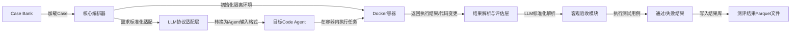

# VC-FCST Benchmark MVP 版本全量细化方案
## 一、MVP 核心原则与边界（1人开发必须严格遵守）
### 核心设计铁律（不可突破）
1.  **极致极简**：能用现成工具绝不自研，能用LLM实现绝不写代码，能用单文件脚本搞定绝不做系统，所有非核心需求100%砍掉
2.  **单栈统一**：全栈仅用Python，无前后端分离，无复杂中间件依赖，1人可全流程覆盖
3.  **LLM优先**：所有适配、生成、解析工作全部交给LLM，仅写薄胶水代码串联流程，最大化LLM能力杠杆
4.  **可复现优先**：所有Case、执行过程、测评结果100%可复现，这是测评基准的核心底线，其他均可妥协
5.  **无状态优先**：所有数据用文件存储，无数据库、无缓存、无集群依赖，零运维成本

### 绝对不做的冗余需求（避免范围蔓延）
❌ 多租户/权限系统、集群化部署、复杂沙箱逃逸防护、全链路追踪、离线回放、数据库、前后端分离项目、灰度发布、合规审计等企业级功能

### 必须守住的核心目标
1.  VC-FCST分类体系100%可测化，每个Case严格绑定对应三级分类。标准全文参考：[VC-FCST](./VC-FCST.md)
2.  测试Case可自动化生成、可复用、可沉淀
3.  可横向对比不同Code Agent（大模型+Harness）在VC-FCST各维度的能力，输出可量化、可复现的测评结果

---

## 二、整体技术栈（1人开发零负担）
| 模块 | 技术选型 | 选型原因 |
|------|----------|----------|
| 核心开发语言 | Python 3.10+ | 全栈通用，生态完善，所有工具均有Python SDK |
| Case Bank存储 | Parquet + Git | 列式存储省空间，Pandas原生支持，Git做版本化管理，零运维 |
| 任务编排与隔离 | Docker SDK for Python | 单容器单Case，避免环境污染，Python原生调用，无需K8s |
| LLM统一调用 | LiteLLM | 一套代码兼容所有LLM厂商（OpenAI/Anthropic/DeepSeek等），无需多SDK开发 |
| 自动化测试 | Pytest + Semgrep | 行业标准工具，客观判断Case通过/失败，无需人工干预 |
| 排行榜可视化 | Streamlit | 纯Python写前端，无需HTML/CSS/JS，1个文件搞定可视化界面 |
| 版本控制 | GitHub | 代码+Case Bank全量托管，版本可追溯，方便开源分享 |

---

## 三、核心交付物1：VC-FCST Case Bank v0.1 详细设计
### 核心目标
覆盖VC-FCST Top 50高频三级分类，每个分类50个有效Case，总计2500个可复用、可自动执行、严格绑定VC-FCST分类的测试用例，有效率≥90%。

### 步骤1：确定Top 50高频三级分类
从全量67个三级分类中，按「Code Agent高发失效、测评区分度高、行业通用」三个原则，筛选Top 50，优先级如下：
| 顶层分类 | 入选三级分类数量 | 核心入选范围 |
|----------|------------------|--------------|
| 1. 需求意图与拆解失效 | 7（全量） | 1.1.1-1.1.4、1.2.1-1.2.3（最高发，占比40%+） |
| 2. 代码执行与交付失效 | 12（全量） | 2.1.1-2.4.3（基础能力必测） |
| 3. 业务逻辑与语义实现失效 | 9（全量） | 3.1.1-3.3.3（核心功能必测） |
| 4. 系统架构与仓库级协同失效 | 10 | 4.1.1-4.1.3、4.2.1-4.2.4、4.3.1-4.3.3（仓库级能力必测） |
| 5. 安全与合规性失效 | 7 | 5.1.1-5.1.4、5.3.1-5.3.3（高危能力必测） |
| 6. 工程化迭代与技术债务失效 | 5 | 6.1.1-6.1.5（迭代能力必测） |
| 7. 人因与团队协作失效 | 0 | MVP阶段暂不覆盖（无自动化测评价值） |

### 步骤2：Case标准化结构（单Case最小完备单元）
每个Case为独立的可执行单元，严格绑定VC-FCST分类，所有字段必填，保证自动化执行与评估：
```python
# 单Case Schema（Parquet存储字段）
{
    "case_id": "str", # 全局唯一ID，格式：VCFCST-{三级分类ID}-{序号}，例：VCFCST-1.1.2-001
    "vcfcst_category": {
        "level1": "str", # 顶层分类名称
        "level2": "str", # 二级分类名称
        "level3_id": "str", # 三级分类ID
        "level3_name": "str", # 三级分类名称
        "defect_desc": "str" # 对应缺陷的核心描述
    },
    "difficulty": "str", # 难度分级：Easy/Medium/Hard，比例4:4:2
    "case_type": "str", # 类型：implement（实现型）/ modify（修改型）
    "requirement": "str", # 给Code Agent的自然语言需求描述（和真实用户输入一致）
    "initial_code": "dict", # 初始代码仓库结构，key为文件路径，value为文件内容
    "acceptance_criteria": {
        "test_code": "dict", # pytest测试用例，key为文件路径，value为测试代码
        "static_check_rules": "list", # Semgrep静态扫描规则（可选）
        "pass_condition": "str" # 客观通过条件，例：pytest通过率100%，无高危扫描告警
    },
    "expected_defect": "str", # 对应VC-FCST分类的预期缺陷，用于评估Agent是否出现该类失效
    "env_config": {
        "base_image": "str", # Docker基础镜像，例：python:3.10-slim
        "dependencies": "list", # 依赖包，例：["pandas==2.2.0", "pytest==8.0.0"]
        "expose_port": "list", # 可选，暴露端口
        "network_disabled": "bool" # 默认True，关闭外网，避免Agent联网抄答案
    }
}
```

### 步骤3：Case自动化生成方案（1人2周搞定2500个Case）
完全用LLM批量生成，仅需人工抽检，最大化降低工作量：
#### 1. 生成Prompt模板（核心资产）
针对每个VC-FCST三级分类，编写固定的生成Prompt，核心要求：
- 严格对齐对应分类的缺陷定义，保证Case能精准测出该类失效
- 需求描述符合真实用户输入习惯，无刻意引导
- 验收测试用例可自动执行，100%客观判断通过/失败
- 初始代码骨架完整，无需额外配置即可运行

示例Prompt（针对1.1.2 需求语义误解分类）：
```
你是VC-FCST测试用例生成专家，需要生成一个严格对应「1.1.2 需求语义误解」分类的测试Case，核心是测试Code Agent是否会错误解读行业术语、业务规则。

请严格按照以下JSON结构输出，不要添加任何额外内容：
{
    "case_id": "VCFCST-1.1.2-{序号}",
    "vcfcst_category": {
        "level1": "需求意图与拆解失效",
        "level2": "需求意图理解失效",
        "level3_id": "1.1.2",
        "level3_name": "需求语义误解",
        "defect_desc": "AI错误解读用户需求中的行业术语、业务规则，生成的代码与用户预期完全不符"
    },
    "difficulty": "Medium",
    "case_type": "implement",
    "requirement": "写一个Python函数，计算电商平台的月活用户数MAU，输入是用户每日登录日志列表，每个元素包含user_id和login_date，输出是当月的MAU数值",
    "initial_code": {
        "src/mau_calculator.py": "def calculate_mau(login_logs):\n    pass\n",
        "requirements.txt": "pytest==8.0.0"
    },
    "acceptance_criteria": {
        "test_code": {
            "tests/test_mau.py": "import pytest\nfrom src.mau_calculator import calculate_mau\n\ndef test_mau_correct_calculation():\n    logs = [\n        {\"user_id\": \"u1\", \"login_date\": \"2026-02-01\"},\n        {\"user_id\": \"u1\", \"login_date\": \"2026-02-05\"},\n        {\"user_id\": \"u2\", \"login_date\": \"2026-02-03\"},\n        {\"user_id\": \"u3\", \"login_date\": \"2026-01-15\"}\n    ]\n    assert calculate_mau(logs) == 2\n\ndef test_empty_logs():\n    assert calculate_mau([]) == 0\n"
        },
        "static_check_rules": [],
        "pass_condition": "pytest tests/test_mau.py 通过率100%"
    },
    "expected_defect": "Agent将MAU错误解读为单用户当月登录天数、总登录次数，而非当月至少登录1次的去重用户数，导致计算结果错误",
    "env_config": {
        "base_image": "python:3.10-slim",
        "dependencies": ["pytest==8.0.0"],
        "expose_port": [],
        "network_disabled": true
    }
}

要求：
1. 需求必须包含明确的行业术语，存在明确的语义误解风险点
2. 测试用例必须能精准检测出语义误解的缺陷，无歧义
3. 初始代码骨架完整，可直接运行
4. 不要使用和示例完全相同的业务场景，换一个新的行业场景（比如金融、物流、内容平台等）
```

#### 2. 批量生成脚本
用Python+LiteLLM写一个单文件批量生成脚本，核心逻辑：
1.  循环遍历Top 50三级分类，每个分类生成50个Case
2.  调用LLM批量生成，按分类写入临时JSON文件
3.  自动校验生成的Case是否符合Schema，缺失必填字段的自动重生成
4.  全量生成完成后，统一写入Parquet文件，完成Case Bank构建

#### 3. Case质量过滤与校验
- **自动化过滤**：用基准Agent 跑一遍所有Case，过滤掉「全量Agent都能100%通过（无区分度）」或「全量Agent都无法通过（难度过高）」的无效Case
- **人工抽检**：每个分类抽检10%的Case，校验分类匹配度、需求合理性、测试用例有效性，保证整体有效率≥90%
- **版本化管理**：最终有效Case存入Parquet文件，和生成脚本一起提交到GitHub，每个版本有明确的变更记录

### 验收标准
1.  覆盖Top 50 VC-FCST三级分类，每个分类至少50个有效Case，总计≥2500个
2.  所有Case严格符合Schema规范，必填字段完整，可直接自动化执行
3.  Case有效率≥90%，基准Agent执行可明确区分通过/失败
4.  难度分布符合Easy:Medium:Hard=4:4:2，实现型:修改型=6:4
5.  全量Case可复现，相同环境下执行结果完全一致

---

## 四、核心交付物2：Simple Orchestrator v0.1 详细设计
### 核心目标
支持3-5个主流Code Agent接入，用LLM做协议适配，实现Case全流程自动化执行、结果回收、标准化评估，无需人工干预，单Case执行成功率≥95%。

### 整体架构（极简4步流程，无多余模块）


### 核心模块设计（单文件可实现）
#### 1. 核心编排器（Orchestrator）
**核心职责**：串联全流程，仅实现6个核心方法，无多余逻辑：
| 方法 | 核心功能 | 实现要点 |
|------|----------|----------|
| load_case() | 从Case Bank加载指定Case/批量Case | 用Pandas读取Parquet文件，支持按分类、难度、ID筛选 |
| init_container() | 初始化Docker隔离容器 | 基于Case的env_config创建容器，注入初始代码，关闭外网，限制1核2G资源，单Case单容器，执行完成后自动销毁 |
| agent_adapter() | 调用LLM协议适配层，转换Case为Agent输入 | 读取对应Agent的适配模板，用LLM填充Case内容，生成对应Agent的标准输入 |
| run_agent() | 调用目标Code Agent执行任务 | 支持API/CLI两种调用方式，超时时间默认10分钟，失败重试2次 |
| parse_and_evaluate() | 回收结果，执行验收测试，输出标准化结果 | 从容器中拉取最终代码、执行日志，运行pytest/Semgrep，输出客观通过/失败结果 |
| save_result() | 把结果写入测评结果库 | 标准化结果结构，追加写入Parquet文件，和Case ID强绑定 |

#### 2. LLM协议适配层（核心，用LLM替代硬编码适配）
**核心设计**：摒弃硬编码的Agent适配代码，每个Agent仅需一个YAML配置文件，用LLM实现输入/输出的双向转换，新增Agent仅需新增一个YAML文件，10分钟即可完成接入。

**Agent适配配置模板示例（OpenHands）**：
```yaml
agent_name: "openhands"
agent_version: "0.15.0"
call_mode: "api" # api/cli
call_config:
  api_base: "https://api.openhands.ai/v1"
  api_key_env: "OPENHANDS_API_KEY"
  timeout: 600
  max_retries: 2

# 输入适配：把标准化Case转换为Agent的输入格式
input_prompt_template: |
  你需要完成以下开发任务，严格按照用户要求执行：
  【任务需求】
  {{ case.requirement }}
  【初始代码仓库结构】
  {{ case.initial_code | to_json }}
  【验收标准】
  你的代码必须通过以下测试用例：
  {{ case.acceptance_criteria.test_code | to_json }}
  【执行要求】
  1. 仅修改需要改动的文件，不要破坏原有代码结构
  2. 所有代码必须在提供的基础镜像中可正常运行
  3. 不要添加任何验收标准外的额外功能

# 输出适配：把Agent的输出转换为标准化结果结构
output_parse_template: |
  请把以下Code Agent的执行结果，解析为标准化JSON结构，严格按照要求输出，不要添加额外内容：
  【Agent执行日志】
  {{ agent_raw_output }}
  【容器内最终代码】
  {{ final_code }}
  【要求】
  输出JSON结构：
  {
    "task_completed": bool, # 是否完成了需求开发
    "code_change_summary": "str", # 代码变更摘要
    "changed_files": "list", # 变更的文件路径列表
    "failure_reason": "str", # 任务失败的原因，无失败则为空
    "has_expected_defect": bool # 是否出现了Case中预期的VC-FCST缺陷
  }
```

**适配逻辑**：
- 输入适配：编排器读取Agent的YAML模板，用Jinja2把Case内容填充到模板中，调用LLM生成对应Agent的标准输入
- 输出适配：把Agent的原始输出、最终代码填充到解析模板中，调用LLM生成标准化的结果结构，无需硬编码解析逻辑

#### 3. 客观验收模块
**核心职责**：100%客观判断Case通过/失败，无人工干预，仅实现2个核心能力：
1.  **测试执行**：在容器内运行pytest测试用例，获取通过率、失败用例、执行日志
2.  **静态扫描**：运行Semgrep静态扫描，检测是否存在预期的安全/规范缺陷
3.  **结果判定**：严格按照Case的`pass_condition`输出最终的`passed`/`failed`结果，无任何主观判断

#### 4. 首批接入的主流Code Agent选型
优先选择**有成熟API/CLI、行业主流、可无界面自动化执行**的Agent，MVP阶段先接入3个，后续可快速扩展：
1.  **Codex**
2.  **Gemini-cli**
3.  **Claude code**

### 验收标准
1.  支持至少3个主流Code Agent接入，新增Agent接入时间≤10分钟
2.  单Case全流程自动化执行，无需人工干预，执行成功率≥95%
3.  任务超时、执行失败有重试机制，异常场景有兜底处理
4.  结果判定100%客观，和验收标准完全一致，无主观偏差
5.  所有执行结果、日志、代码变更完整留存，100%可复现

---

## 五、核心交付物3：Code Agent VC-FCST 能力排行榜 详细设计
### 核心目标
输出可横向对比的量化排行榜，结合雷达图直观展示不同Agent在VC-FCST各维度的能力，纯Python实现，1个文件搞定。

### 核心量化指标体系（和VC-FCST强绑定）
| 指标类型 | 核心指标 | 计算方式 | 指标用途 |
|----------|----------|----------|----------|
| 整体能力指标 | 整体通过率 | （通过Case数/总执行Case数）*100% | 整体排名核心依据 |
| 分类能力指标 | 三级分类通过率 | （该分类下通过Case数/该分类总Case数）*100% | 雷达图、分类对比核心依据 |
| 分类能力指标 | 顶层分类平均通过率 | 该顶层分类下所有三级分类通过率的平均值 | 雷达图维度 |
| 缺陷防控指标 | 缺陷逃逸率 | （出现预期缺陷的Case数/总Case数）*100% | 评估Agent的缺陷防控能力 |
| 难度分层指标 | Easy/Medium/Hard通过率 | 对应难度下的Case通过率 | 评估Agent的能力边界 |
| 效率指标 | 平均执行时长 | 单Case平均执行时间（分钟） | 评估Agent的执行效率 |
| 成本指标 | 平均Token消耗 | 单Case平均Token消耗量 | 评估Agent的使用成本 |

### 可视化设计（Streamlit实现）
#### 1. 核心页面结构（1个Python文件实现）
| 页面模块 | 核心内容 | 实现方式 |
|----------|----------|----------|
| 总排行榜 | 所有接入Agent的整体排名，按整体通过率降序排列，展示核心指标 | Streamlit DataFrame，支持排序、筛选 |
| 能力雷达图 | 7大VC-FCST顶层分类为维度，展示每个Agent的平均通过率，多Agent对比 | Plotly 雷达图，支持多Agent叠加对比 |
| 分类详情 | 每个VC-FCST三级分类的Agent通过率排名，柱状图展示 | Plotly 柱状图，支持按分类筛选 |
| Case级详情 | 每个Case的执行详情、代码变更、测试结果、失败原因，支持搜索筛选 | Streamlit 可折叠面板，支持按Case ID、分类、Agent筛选 |
| 报告导出 | 支持导出完整测评报告PDF、排行榜数据Excel | Streamlit 下载按钮，原生支持 |

#### 2. 核心可视化示例
- **雷达图**：X轴为7大VC-FCST顶层分类，Y轴为通过率（0-100%），每个Agent一条曲线，一眼可看出Agent的强项/弱项
- **分类排名柱状图**：X轴为Agent名称，Y轴为对应分类的通过率，按通过率降序排列，直观对比同一分类下的Agent能力
- **总排行榜**：表格形式，包含Agent名称、整体通过率、平均执行时长、平均Token消耗、缺陷逃逸率，支持点击跳转对应分类详情

### 验收标准
1.  展示所有接入Agent的整体排名，核心指标完整
2.  支持多Agent的VC-FCST维度雷达图对比，直观展示能力差异
3.  支持按分类、难度、Case ID筛选查看详情，结果可追溯
4.  支持测评报告、原始数据导出
5.  页面可一键启动，无需复杂部署，Streamlit run 即可访问

---

## 六、3个月开发里程碑（1个全栈工程师可落地）
| 阶段 | 时间 | 核心任务 | 交付物 | 验收标准 |
|------|------|----------|--------|----------|
| 第一阶段 | 第1-4周 | Case Bank v0.1 开发 | VC-FCST Case Bank v0.1 Parquet文件、生成脚本、使用文档 | 覆盖Top 50分类，≥2500个有效Case，有效率≥90%，可直接执行 |
| 第二阶段 | 第5-8周 | Simple Orchestrator v0.1 开发 | Orchestrator核心代码、Agent适配配置、使用文档 | 支持3个主流Agent接入，自动化执行成功率≥95%，结果100%客观可复现 |
| 第三阶段 | 第9-12周 | 排行榜+MVP全量联调 | 排行榜Streamlit页面、第一版测评报告、MVP完整代码仓库 | 排行榜完整展示所有指标，全流程端到端跑通，可输出可复现的Agent横向测评结果 |

### 每周详细拆分
- **第1周**：确定Top 50分类，定义Case Schema，开发Case生成Prompt模板，完成小批量试点生成
- **第2周**：优化Prompt模板，批量生成2500个Case，完成Schema自动校验
- **第3周**：用基准Agent过滤无效Case，人工抽检10%，完成Case质量优化
- **第4周**：Case Bank标准化，Parquet文件存储，编写文档，完成第一交付物
- **第5周**：搭建技术栈，开发Orchestrator核心框架，Docker环境集成，LiteLLM封装
- **第6周**：开发LLM协议适配层，完成容器初始化、Case加载、结果保存核心流程
- **第7周**：接入3个主流Code Agent，开发客观验收模块，完成单Case全流程跑通
- **第8周**：全流程联调，添加超时重试、异常兜底，编写文档，完成第二交付物
- **第9周**：开发指标计算模块，定义排行榜核心指标，开发Plotly可视化组件
- **第10周**：开发Streamlit排行榜页面，完成总排名、雷达图、分类详情、Case详情模块
- **第11周**：全量Case批量执行，跑通所有接入Agent，生成第一版测评数据，优化页面体验
- **第12周**：Bug修复，文档完善，MVP版本发布，完成所有交付物

---

## 七、风险缓解与成本控制
### 核心风险缓解
1.  **Case生成质量不足**：先做小批量试点，优化Prompt模板后再批量生成；用基准Agent自动过滤无效Case，仅人工抽检10%，降低工作量
2.  **Agent接入困难**：优先接入Aider（CLI本地运行，接入成本最低），再接入OpenHands、Sweep，MVP阶段先完成3个接入，不追求数量
3.  **工作量超支**：严格遵守MVP边界，所有非核心需求全部砍掉，先实现最小可用流程，再做优化
4.  **测评结果不可复现**：单Case单容器，固定基础镜像，关闭外网，所有依赖版本锁定，执行日志全量留存

### 成本控制
1.  **Token成本**：Case批量生成用DeepSeek V3（成本0.0012元/千Token），2500个Case总Token消耗约250万，成本仅3000元左右；执行阶段的适配解析用小模型，进一步降低成本
2.  **服务器成本**：仅需一台4核8G云服务器，按月付费，成本约200元/月，3个月总计600元
3.  **总预算**：MVP阶段总现金成本不超过5000元，完全可控

---

## 八、MVP边界与后续演进路线
### MVP明确不做的
- 多租户、权限系统、集群化部署、高可用设计
- 复杂的安全沙箱、逃逸防护、合规审计
- 全链路追踪、监控告警、离线回放
- 数据库、缓存、消息队列等中间件
- 复杂的Web界面、API网关

### 后续演进路线（MVP验证成功后）
1.  **v0.2**：扩展Case Bank到全量67个分类，每个分类100个Case；接入5+主流Code Agent
2.  **v0.3**：添加简化版红蓝对抗机制，优化Case质量；添加批量并行执行能力，提升测评效率
3.  **v0.4**：添加可视化Case管理界面，支持自定义Case上传；开源Case Bank与Benchmark框架
4.  **v1.0**：完善企业级特性，支持私有化部署，推动VC-FCST成为行业测评标准